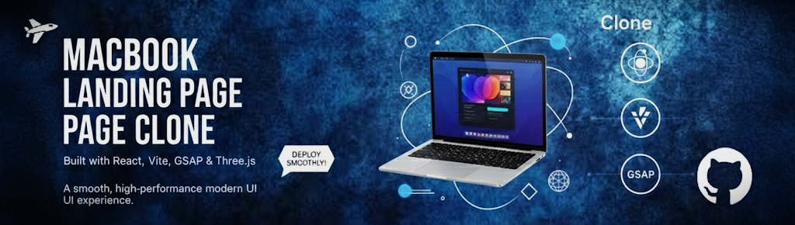

<div align="center">
  <br />
  <a href="" target="_blank">
    
  </a>
  <br />

  <div>
    
    
    
    
    
    
  </div>

  <h3 align="center">MacBook Landing Page Clone</h3>
</div>

## 📋 Table of Contents

1. ✨ [Introduction](#introduction)
2. ⚙️ [Tech Stack](#tech-stack)
3. 🔋 [Features](#features)
4. 🤸 [Quick Start](#quick-start)

---

## ✨ Introduction

A modern **Apple-style 3D landing page** built with **React, Three.js, GSAP, and TailwindCSS**.  
This project recreates the immersive feel of Apple product pages using:

- Cinematic 3D product scenes  
- Scroll-triggered model animations  
- Masking and reveal effects  
- Smooth timeline-based transitions  
- Fully responsive, minimal, premium UI  

Perfect for developers exploring **scroll-based 3D interactions** and **production-quality web animations**.

---

## ⚙️ Tech Stack

### **🧠 CodeRabbit**  
AI-powered code review assistant for VS Code, GitHub, and GitLab.  
Provides real-time suggestions, security checks, PR reviews, and adapts to your coding style.

### **⚡ GSAP (GreenSock Animation Platform)**  
Used to control scroll-driven interactions:  
- SplitText animations  
- ScrollTrigger timelines  
- Parallax & pinned sections  
- Scroll-synced video/image transitions  
- Advanced masking and reveal effects  
- Smooth carousel animations

### **⚛️ React**  
Component-based architecture enabling reusable UI sections, clean structure, and tight integration with GSAP + Three.js logic.

### **🎨 Tailwind CSS**  
Utility-first styling with responsive classes, fast layout building, and clean design.

### **🎬 Three.js**  
Handles all WebGL 3D rendering, including:  
- Lighting  
- Cameras  
- Materials  
- Model loading  
- Post-processing effects  
- Raycasting and scene interactivity  

### **⚡ Vite**  
Ultra-fast dev server and build tool with instant HMR—ideal for animation-heavy environments.

### **📦 Zustand**  
Lightweight global state library with minimal boilerplate and fast reactivity.

---

## 🔋 Features

👉 **Realistic 3D Product Scene**  
High-quality 3D visuals with dynamic lighting.

👉 **Scroll-Driven 3D Animation**  
Models animate smoothly in response to scroll position.

👉 **GSAP ScrollTrigger Magic**  
Fine control over timeline animation and scroll sync.

👉 **Pinned & Stacked Sections**  
Content locks into view to build immersive storytelling.

👉 **Image Masking & Reveal Effects**  
Seamless transitions and high-end visual effects.

👉 **Multi-Section Timelines**  
Animations progress naturally across large sections.

👉 **Fully Responsive UI**  
Fluid layouts paired with adaptive animations.

…and many more enhancements focusing on structure, reusability, and modern web animation.

---

## 🤸 Quick Start

### **Prerequisites**

- [Git](https://git-scm.com/)  
- [Node.js](https://nodejs.org/en)  
- [npm](https://www.npmjs.com/)

---

### **Clone the Repository**

```bash
git clone https://github.com/aswazone/macbook_gsap_landing.git
cd macbook_gsap_landing
